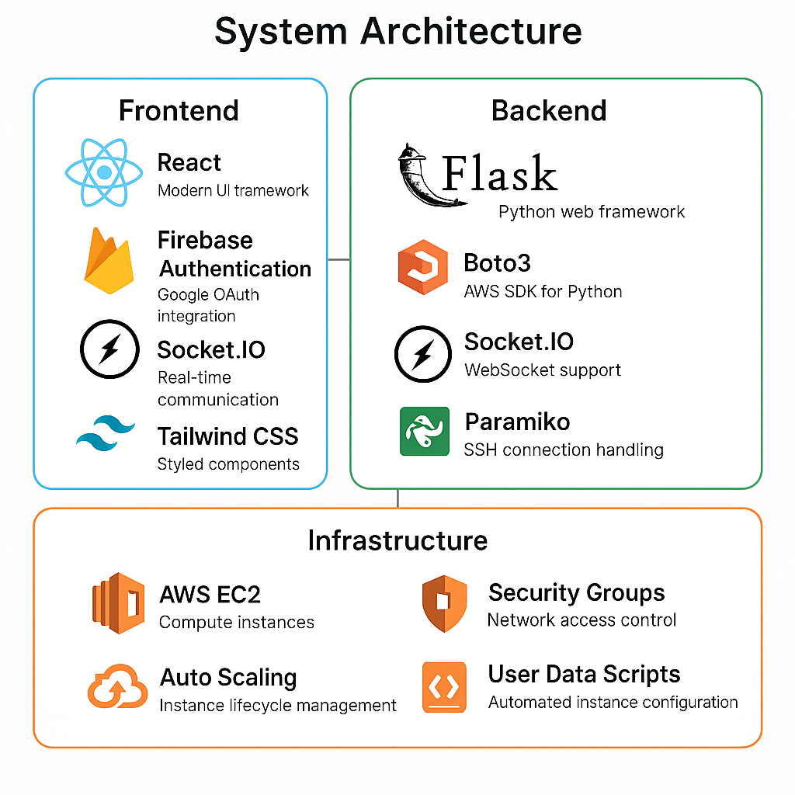

# NCLAAS - Netcat Listener as a Service

A cloud-based service that provides temporary, on-demand Netcat listeners on AWS EC2 instances. Perfect for penetration testing, security research, and network debugging.

## Features

### Core Functionality
- **One-Click Instance Launch**: Deploy AWS EC2 instances with Netcat pre-installed
- **Auto-Termination**: Instances automatically shut down after 15 minutes to control costs
- **Real-time Terminal**: Web-based terminal interface for direct interaction
- **Reverse Shell Support**: Built-in reverse shell payloads for penetration testing
- **IP-based Security**: Dynamic security group creation with user IP restrictions
- **Google Authentication**: Secure user authentication via Firebase

### Security Features
- **Dynamic Security Groups**: Creates isolated security groups per user
- **IP Whitelisting**: Restricts SSH access to user's IP address
- **Auto-Cleanup**: Automatic instance termination prevents resource waste
- **Rate Limiting**: Daily launch limits to prevent abuse

### User Interface
- **Modern Web UI**: Clean, responsive interface with dark theme
- **Real-time Status**: Live instance status and countdown timer
- **Copy-to-Clipboard**: One-click copying of commands and payloads
- **Floating Windows**: Organized information panels for different tools

## Architecture

<div align="center">
  
</div>

### Frontend (React)
- **React.js**: Modern UI framework
- **Firebase Authentication**: Google OAuth integration
- **Socket.IO**: Real-time communication
- **Tailwind CSS**: Styled components

### Backend (Flask)
- **Flask**: Python web framework
- **Boto3**: AWS SDK for Python
- **Socket.IO**: WebSocket support
- **Paramiko**: SSH connection handling

### Infrastructure (Terraform)
- **AWS EC2**: Compute instances
- **Security Groups**: Network access control
- **Auto Scaling**: Instance lifecycle management
- **User Data Scripts**: Automated instance configuration

## Technology Stack

### Frontend
- React.js
- Firebase Authentication
- Socket.IO Client
- Tailwind CSS
- Classnames utility

### Backend
- Flask
- Boto3 (AWS SDK)
- Flask-SocketIO
- Eventlet
- Paramiko

### Infrastructure
- Terraform
- AWS EC2
- AWS Security Groups
- AWS VPC

## Getting Started

### Prerequisites
- AWS Account with EC2 permissions
- Node.js and npm
- Python 3.8+
- Terraform

### Environment Variables

#### Frontend (.env)
```bash
REACT_APP_FIREBASE_API_KEY=your_firebase_api_key
REACT_APP_FIREBASE_AUTH_DOMAIN=your_project.firebaseapp.com
REACT_APP_FIREBASE_PROJECT_ID=your_project_id
REACT_APP_FIREBASE_STORAGE_BUCKET=your_project.appspot.com
REACT_APP_FIREBASE_MESSAGING_SENDER_ID=your_sender_id
REACT_APP_FIREBASE_APP_ID=your_app_id
REACT_APP_FIREBASE_MEASUREMENT_ID=your_measurement_id
```

#### Backend (.env)
```bash
AWS_REGION=us-east-1
AMI_ID=ami-xxxxxxxxx
INSTANCE_TYPE=t2.micro
KEY_NAME=your-ssh-key-name
SECURITY_GROUP_NAME=netcat-sg
```

### Installation

1. **Clone the repository**
```bash
git clone <repository-url>
cd netcat-listener-as-a-service
```

2. **Install frontend dependencies**
```bash
cd frontend
npm install
```

3. **Install backend dependencies**
```bash
cd ../backend
pip install -r requirements.txt
```

4. **Deploy infrastructure with Terraform**
```bash
cd ../infrastructure
terraform init
terraform plan -var="key_name=YOUR_KEY" -var="user_ip_cidr=YOUR_IP/32"
terraform apply -var="key_name=YOUR_KEY" -var="user_ip_cidr=YOUR_IP/32"
```

5. **Start the backend server**
```bash
cd ../backend
python app.py
```

6. **Start the frontend development server**
```bash
cd ../frontend
npm start
```

## Terraform Infrastructure

### What Terraform Manages

1. **EC2 Instance**
   - Ubuntu AMI with pre-configured security
   - Auto-shutdown after 30 minutes
   - Public IP assignment
   - User data script for Netcat installation

2. **Security Groups**
   - SSH access (port 22) restricted to user IP
   - Netcat ports (4444-5000) open to all
   - Dynamic security group creation per user

3. **Network Configuration**
   - VPC and subnet configuration
   - Internet gateway attachment
   - Route table configuration

### Terraform Files Structure

```
infrastructure/
├── main.tf          # Main Terraform configuration
├── outputs.tf       # Output values (instance ID, public IP)
├── user_data.sh     # EC2 instance initialization script
└── README.md        # Infrastructure documentation
```

### Key Terraform Features

- **Variable-based Configuration**: Flexible deployment with user-specific parameters
- **State Management**: Tracks infrastructure state for updates and destruction
- **Auto-cleanup**: Instances automatically terminate to prevent cost overruns
- **Security-first**: Minimal network exposure with IP-based restrictions

## Usage

### Launching an Instance
1. Sign in with Google account
2. Click "Boot Netcat Instance"
3. Wait for instance to be ready
4. Use provided SSH command to connect
5. Run Netcat listener commands

### Available Commands
- **Basic Netcat Listener**: `nc -lvnp 4444`
- **Reverse Shell**: `nc -lvnp 4444 -e /bin/bash`
- **UDP Listener**: `nc -luvnp 4444`

### Security Considerations
- Instances auto-terminate after 15 minutes
- SSH access restricted to your IP address
- Daily launch limits prevent abuse
- All network traffic is logged

## Security

### Network Security
- **IP Whitelisting**: SSH access limited to user's IP
- **Port Restrictions**: Only necessary ports are open
- **Security Groups**: Isolated network access per user

### Application Security
- **Google OAuth**: Secure authentication
- **Rate Limiting**: Prevents abuse and cost overruns
- **Auto-cleanup**: No orphaned instances
- **Environment Variables**: No hardcoded secrets

### AWS Security
- **IAM Roles**: Minimal required permissions
- **VPC Isolation**: Network segmentation
- **Security Groups**: Fine-grained access control

## Monitoring

### Instance Monitoring
- Real-time status updates
- Countdown timer for auto-termination
- Instance ID and IP tracking
- Error logging and debugging

### Cost Management
- 15-minute instance lifetime
- Daily launch limits
- Automatic cleanup
- Resource usage tracking

## Deployment

### Production Deployment
1. Set up AWS credentials
2. Configure environment variables
3. Deploy Terraform infrastructure
4. Start backend server
5. Build and deploy frontend

### Development Setup
1. Install dependencies
2. Set up local environment variables
3. Start development servers
4. Use local Terraform for testing

## Contributing

1. Fork the repository
2. Create a feature branch
3. Make your changes
4. Test thoroughly
5. Submit a pull request

## License

This project is licensed under the MIT License - see the LICENSE file for details.

## Disclaimer

This tool is intended for legitimate security testing and research purposes only. Users are responsible for complying with all applicable laws and regulations. The authors are not responsible for any misuse of this software.

## Support

For issues and questions:
- Create an issue on GitHub
- Check the documentation
- Review the troubleshooting guide

---

**Built with love for the security community** 